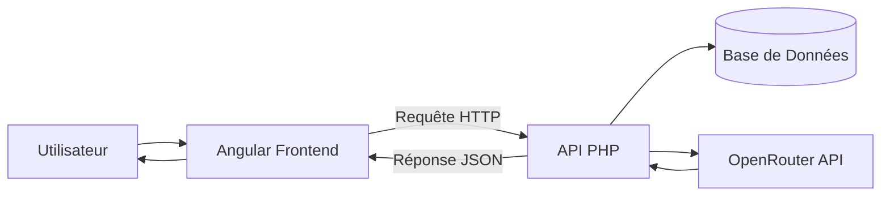

# Rapport de Présentation du Projet - Espace Parent & Admin

Ce document présente les différentes fonctionnalités de la plateforme avec une description technique simplifiée pour chaque interface.

---

## Flux de Données du Projet

**Explication simple :**
L'utilisateur interagit avec Angular qui envoie les demandes au serveur PHP. Le serveur consulte la base de données et l'intelligence artificielle (via OpenRouter), puis renvoie le résultat à l'écran.

---

## 1. Authentification

### Page d'Inscription (Registration)

> **Description :** L'utilisateur crée son profil en renseignant son nom, email et mot de passe.
> **Fonctionnement technique :** Lors du clic sur "S'inscrire", les données sont envoyées par un **Service Angular** via une **requête HTTP** vers une **API PHP**. Cette dernière vérifie si l'utilisateur existe déjà avant de créer le nouveau compte dans la base de données.

### Page de Connexion (Login)

> **Description :** L'utilisateur accède à son compte en saisissant ses identifiants (email et mot de passe).
> **Fonctionnement technique :** Les identifiants sont envoyés par un **Service Angular** via une **requête HTTP** vers l'**API PHP** qui valide les informations. Si elles sont correctes, le serveur autorise l'accès et l'utilisateur est redirigé vers son espace personnel.

---

## 2. Espace Parent

### Questionnaire de Profilage

> **Description :** Ce formulaire permet au parent de définir le profil de son enfant (niveau scolaire, matières cibles, besoins spécifiques).
> **Fonctionnement :** Ces données sont stockées pour permettre à l'intelligence artificielle de fournir des réponses personnalisées et pertinentes.

### Assistant AI (Chatbot)

> **Description :** Une interface de discussion interactive où le parent peut poser des questions à l'assistant.
> **Fonctionnement technique :** Le système utilise la technologie RAG (Retrieval-Augmented Generation) : il recherche des informations dans la bibliothèque de documents puis génère une réponse précise via l'IA.

### Bibliothèque de Ressources

> **Description :** Un espace regroupant tous les documents pédagogiques et supports d'apprentissage disponibles.

### Conseils & Astuces

> **Description :** Cette page propose des recommandations et des bonnes pratiques pour accompagner l'éducation de l'enfant.

### Gérer mon Compte

> **Description :** Interface permettant au parent de modifier ses informations personnelles (nom, email) et de gérer ses préférences de sécurité.

---

## 3. Espace Administration

### Tableau de Bord Admin (Dashboard)

> **Description :** Vue d'ensemble montrant les statistiques clés de la plateforme et l'activité récente.

### Gestion des Utilisateurs

> **Description :** Outil permettant à l'administrateur de voir, modifier ou supprimer les comptes des parents et des enfants.

### Statistiques Globales

> **Description :** Graphiques et données détaillées sur l'utilisation du système (nombre d’utilisateurs, sessions de chat, etc.).
